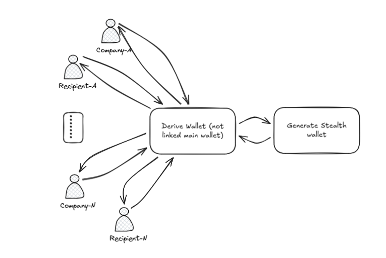
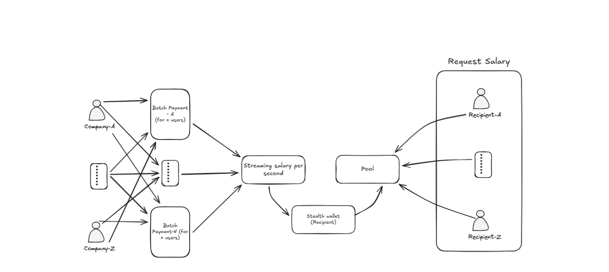
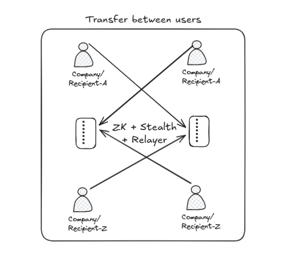

# Offuscate

**Private Payroll Infrastructure for Solana**

Offuscate is the first **privacy-first B2B payroll platform** on Solana. Pay employees, contributors, and suppliers without exposing salaries, payouts, or treasury activity on-chain — using stealth addresses, ZK compression, and gasless relayers.

    

---

## Table of Contents

- [The Problem](#the-problem-blockchain-is-100-public)
- [The Solution](#the-solution-4-layers-of-privacy)
- [Core Technologies](#core-technologies)
  - [Stealth Addresses (ECDH)](#1-stealth-addresses-ecdh)
  - [ZK Compression (Light Protocol)](#2-zk-compression-light-protocol)
  - [Helius Infrastructure](#3-helius-infrastructure)
  - [Gasless Relayer](#4-gasless-relayer)
- [Features](#features)
- [Architecture](#architecture)
- [System Diagrams](#system-diagrams)
  - [Derive Stealth Wallet](#diagram-1-derive-stealth-wallet)
  - [Payroll Flow](#diagram-2-payroll-flow-streaming)
  - [Transfer Between Users](#diagram-3-transfer-between-users-full-privacy)
- [Getting Started](#getting-started)
- [Usage](#usage)
- [Security](#security-considerations)
- [Roadmap](#roadmap)

---

## The Problem: Blockchain is 100% Public

Every transaction on Solana is **permanently visible** to anyone. For payroll, this creates serious risks:

| Exposure | Risk | Impact |
|----------|------|--------|
| **Employee salaries visible** | Anyone can see how much you earn | Targeted scams, social engineering, kidnapping risk |
| **Company payroll exposed** | Competitors see your budget | Strategic disadvantage, poaching |
| **Payment patterns tracked** | All spending traceable forever | Privacy violations, profiling |
| **Recipient addresses public** | Employees linked to employers | Loss of anonymity |

### Real-World Scenarios

**Scenario 1: The Targeted Employee**
> Alice receives 10,000 USDC/month from a known DeFi protocol. Her wallet is public. Scammers now know she has money and target her with phishing attacks. Worse, in some regions, this makes her a kidnapping target.

**Scenario 2: The Exposed Startup**
> A startup pays its 20 employees on-chain. Competitors can see exactly: total payroll budget, individual salaries, hiring rate, and burn rate. They use this to poach employees and outbid on talent.

**Scenario 3: The Tracked Freelancer**
> Bob freelances for multiple DAOs. Each payment is public. Anyone can see his total income, all his clients, and payment frequency. His financial life is an open book.

### The Numbers
- **100%** of Solana transactions are publicly visible
- **0** private payroll solutions exist on Solana
- **$50B+** global payroll market
- **2,500+** active projects on Solana need this

---

## The Solution: 4 Layers of Privacy

Offuscate combines multiple privacy technologies into a single, easy-to-use platform:

```
┌─────────────────────────────────────────────────────────────┐
│  LAYER 4: Relayer (Gasless)        → Hides fee payer        │
├─────────────────────────────────────────────────────────────┤
│  LAYER 3: ZK Compression           → Hides sender + amount  │
├─────────────────────────────────────────────────────────────┤
│  LAYER 2: Stealth Addresses        → Hides recipient        │
├─────────────────────────────────────────────────────────────┤
│  LAYER 1: Streaming Payroll        → Salary per second      │
└─────────────────────────────────────────────────────────────┘
```

### Privacy Matrix

| Option | Sender | Recipient | Amount | Fee Payer | Best For |
|--------|--------|-----------|--------|-----------|----------|
| Standard | Visible | Visible | Visible | Visible | Public payments |
| Stealth Address | Visible | **Hidden** | Visible | Visible | Hide who receives |
| ZK Compression | **Hidden** | Visible | **Hidden** | Visible | Hide how much |
| ZK + Stealth | **Hidden** | **Hidden** | **Hidden** | Visible | Maximum privacy |
| **ZK + Stealth + Relayer** | **Hidden** | **Hidden** | **Hidden** | **Hidden** | **Ultimate privacy** |

---

## Core Technologies

### 1. Stealth Addresses (ECDH)

#### What It Is

Stealth addresses are **one-time addresses** generated for each payment using Elliptic Curve Diffie-Hellman (ECDH) key exchange. The recipient publishes a "meta address" and senders derive unique addresses that only the recipient can spend from.

#### How It Works

```
┌──────────────────────────────────────────────────────────────────────────┐
│                        STEALTH ADDRESS FLOW                               │
└──────────────────────────────────────────────────────────────────────────┘

  RECIPIENT (Employee)                         SENDER (Employer)
  ──────────────────────                       ─────────────────
        │                                            │
        │  1. Generate keypairs                      │
        │     • View keypair (v, V)                  │
        │     • Spend keypair (s, S)                 │
        │                                            │
        │  2. Publish Meta Address                   │
        │     st:<V>:<S>                             │
        │     ─────────────────────────────────────► │
        │                                            │
        │                                      3. Generate ephemeral keypair
        │                                         • (r, R)
        │                                            │
        │                                      4. Compute shared secret
        │                                         • secret = r * V
        │                                            │
        │                                      5. Derive stealth address
        │                                         • P = S + hash(secret)*G
        │                                            │
        │                                      6. Send funds to P
        │                                         + memo with R (ephemeral pubkey)
        │     ◄───────────────────────────────────── │
        │                                            │
  7. Scan for payments                               │
     • Find R in memo                                │
     • Compute secret = v * R                        │
     • Derive P = S + hash(secret)*G                 │
     • If P has balance → it's for us!              │
        │                                            │
  8. Derive spending key                             │
     • p = s + hash(secret)                          │
     • Spend from P                                  │
        │                                            │
└──────────────────────────────────────────────────────────────────────────┘
```

#### Why It Matters

| Without Stealth Addresses | With Stealth Addresses |
|---------------------------|------------------------|
| Recipient wallet is public | Each payment goes to unique address |
| All payments linkable | Payments unlinkable to each other |
| Employer-employee link visible | No on-chain connection |
| Financial history exposed | Fresh address every time |

#### Use Cases

| Use Case | How Stealth Helps |
|----------|-------------------|
| **Payroll** | Employees receive salary to one-time addresses. No one can see their total earnings or link payments to their main wallet. |
| **Contractor Payments** | Freelancers get paid without revealing all their clients or total income. |
| **Sensitive Donations** | Donate to causes without public association. The recipient knows, but the blockchain doesn't link you. |
| **Vendor Payments** | Pay suppliers without competitors knowing your supplier relationships. |

#### Implementation

```typescript
// Employee publishes their meta address (one-time setup)
const metaAddress = getStealthMetaAddress(stealthKeys);
// Format: "st:viewPublicKey:spendPublicKey"

// Employer sends payment
const { stealthAddress, ephemeralPubKey } = deriveStealthAddress(metaAddress);
// Send SOL to stealthAddress with memo "stealth:<ephemeralPubKey>"

// Employee scans and claims
const spendingKey = deriveStealthSpendingKey(
  ephemeralPubKey,
  viewPrivateKey,
  spendPublicKey
);
// Transfer funds using spendingKey
```

---

### 2. ZK Compression (Light Protocol)

#### What It Is

ZK Compression uses **zero-knowledge proofs** to create compressed accounts on Solana. Transactions are validated cryptographically without revealing the sender address or transaction amount on-chain.

#### How It Works

```
┌──────────────────────────────────────────────────────────────────────────┐
│                        ZK COMPRESSION FLOW                                │
└──────────────────────────────────────────────────────────────────────────┘

  TRADITIONAL TRANSFER                    ZK COMPRESSED TRANSFER
  ────────────────────                    ──────────────────────

  ┌─────────────────────┐                 ┌─────────────────────┐
  │ Transaction Data    │                 │ Transaction Data    │
  │                     │                 │                     │
  │ From: 7xKp...3nF    │  ──────────►    │ From: [HIDDEN]      │
  │ To:   9mQr...8kL    │                 │ To:   9mQr...8kL    │
  │ Amount: 1000 SOL    │                 │ Amount: [HIDDEN]    │
  │                     │                 │ Proof: 0x7f3a...    │
  └─────────────────────┘                 └─────────────────────┘

        │                                         │
        ▼                                         ▼

  ┌─────────────────────┐                 ┌─────────────────────┐
  │ On-Chain (Public)   │                 │ On-Chain (Public)   │
  │                     │                 │                     │
  │ • Sender visible    │                 │ • Sender HIDDEN     │
  │ • Amount visible    │                 │ • Amount HIDDEN     │
  │ • Fully traceable   │                 │ • Only proof visible│
  └─────────────────────┘                 └─────────────────────┘

                                          The ZK proof mathematically
                                          guarantees the transaction
                                          is valid WITHOUT revealing
                                          who sent it or how much.
```

#### Why It Matters

| Without ZK Compression | With ZK Compression |
|------------------------|---------------------|
| Sender address visible | Sender completely hidden |
| Amount visible on explorer | Amount encrypted in proof |
| Transaction graph analyzable | Graph analysis impossible |
| Salary amounts exposed | Salary amounts private |

#### Use Cases

| Use Case | How ZK Compression Helps |
|----------|--------------------------|
| **Hide Salary Amounts** | Employees claim salary without revealing how much. Observers see a transaction but not the value. |
| **Protect Treasury** | Company payments don't reveal budget allocation or total treasury size. |
| **Private Transfers** | Send money to anyone without amount being public. |
| **Competitive Intelligence Defense** | Competitors can't analyze your on-chain spending patterns. |

#### Implementation

```typescript
import { compress, transfer } from '@lightprotocol/stateless.js';

// Compress SOL (hide in ZK state)
const compressedAccount = await compress(connection, wallet, amount);

// Transfer with ZK proof (sender + amount hidden)
const result = await transfer(
  connection,
  wallet,
  compressedAccount,
  recipientAddress,
  amount
);
// On-chain: only the ZK proof is visible, not sender or amount
```

#### Light Protocol Integration

| Feature | How Offuscate Uses It |
|---------|----------------------|
| **Compressed Accounts** | Store salary in compressed state |
| **ZK Transfers** | Move funds without revealing source |
| **Proof Generation** | Client-side proof creation |
| **State Verification** | On-chain verification without exposure |

---

### 3. Helius Infrastructure

#### What It Is

Helius is Solana's leading RPC and infrastructure provider. Offuscate uses Helius for **high-performance RPC**, **transaction parsing**, **webhooks**, and **real-time monitoring** — all essential for a privacy-preserving payroll system.

#### How It Works

```
┌──────────────────────────────────────────────────────────────────────────┐
│                        HELIUS INTEGRATION                                 │
└──────────────────────────────────────────────────────────────────────────┘

                         ┌─────────────────────┐
                         │   Offuscate App     │
                         └──────────┬──────────┘
                                    │
              ┌─────────────────────┼─────────────────────┐
              │                     │                     │
              ▼                     ▼                     ▼
    ┌─────────────────┐   ┌─────────────────┐   ┌─────────────────┐
    │   Helius RPC    │   │  Enhanced API   │   │    Webhooks     │
    │                 │   │                 │   │                 │
    │ • Fast queries  │   │ • Parse txs     │   │ • Real-time     │
    │ • ZK support    │   │ • Enrich data   │   │ • Stealth detect│
    │ • Reliable      │   │ • Index history │   │ • Notifications │
    └─────────────────┘   └─────────────────┘   └─────────────────┘
              │                     │                     │
              └─────────────────────┼─────────────────────┘
                                    │
                                    ▼
                         ┌─────────────────────┐
                         │   Solana Network    │
                         └─────────────────────┘
```

#### Why It Matters

| Without Helius | With Helius |
|----------------|-------------|
| Slow public RPC | 50ms response times |
| No transaction parsing | Rich transaction data |
| Manual scanning | Real-time webhooks |
| Rate limited | High throughput |

#### Use Cases

| Helius Feature | How Offuscate Uses It |
|----------------|----------------------|
| **RPC Endpoint** | All blockchain operations — sending transactions, querying balances, ZK compression operations |
| **Enhanced Transactions API** | Parse stealth payment memos, extract ephemeral keys, classify privacy levels |
| **Webhooks** | Real-time detection of incoming stealth payments — notify users instantly |
| **Transaction Enrichment** | Human-readable payment history, automatic privacy level tagging |

#### Implementation

```typescript
// RPC for all operations
const connection = new Connection(
  `https://devnet.helius-rpc.com?api-key=${HELIUS_API_KEY}`
);

// Enhanced Transaction API - parse stealth memos
const response = await fetch(
  `https://api.helius.xyz/v0/transactions?api-key=${HELIUS_API_KEY}`,
  {
    method: 'POST',
    body: JSON.stringify({ transactions: [signature] })
  }
);
const parsed = await response.json();
// Extract "stealth:<ephemeralKey>" from memo

// Webhook for real-time stealth payment detection
// POST /api/helius/webhook
// Helius calls this when new transactions match our filter
export async function POST(req: Request) {
  const transactions = await req.json();
  for (const tx of transactions) {
    const ephemeralKey = parseStealthMemo(tx);
    if (ephemeralKey) {
      await notifyRecipient(ephemeralKey);
    }
  }
}
```

#### Helius Privacy Detection Flow

```
1. Stealth payment sent with memo: "stealth:<ephemeralKey>"
                    ↓
2. Helius Webhook receives transaction instantly
                    ↓
3. parseStealthMemo() extracts ephemeral key
                    ↓
4. Notification created for recipient
                    ↓
5. Recipient scans & claims via Enhanced Transactions API
```

---

### 4. Gasless Relayer

#### What It Is

The Relayer is a **server-side wallet** that submits transactions on behalf of users. This hides the fee payer identity — the final piece of the privacy puzzle. Users sign transactions, but the relayer pays gas and submits them.

#### How It Works

```
┌──────────────────────────────────────────────────────────────────────────┐
│                        RELAYER FLOW                                       │
└──────────────────────────────────────────────────────────────────────────┘

  WITHOUT RELAYER                          WITH RELAYER
  ───────────────                          ────────────

  User Wallet                              User Wallet
      │                                        │
      │ Signs + Pays Gas                       │ Signs only
      │                                        │
      ▼                                        ▼
  ┌─────────────────┐                     ┌─────────────────┐
  │ Transaction     │                     │ Partial TX      │
  │                 │                     │ (user signature)│
  │ Fee Payer: USER │                     └────────┬────────┘
  │ (VISIBLE!)      │                              │
  └────────┬────────┘                              │
           │                                       ▼
           │                              ┌─────────────────┐
           │                              │    RELAYER      │
           │                              │                 │
           │                              │ • Adds gas fee  │
           │                              │ • Signs as payer│
           │                              │ • Submits TX    │
           │                              └────────┬────────┘
           │                                       │
           ▼                                       ▼
  ┌─────────────────┐                     ┌─────────────────┐
  │ On-Chain        │                     │ On-Chain        │
  │                 │                     │                 │
  │ Fee Payer: USER │                     │ Fee Payer:      │
  │ ───────────────►│                     │ RELAYER WALLET  │
  │ Links user to TX│                     │ (Not linked to  │
  └─────────────────┘                     │  user!)         │
                                          └─────────────────┘
```

#### Why It Matters

| Without Relayer | With Relayer |
|-----------------|--------------|
| User pays gas → linked to transaction | Relayer pays gas → user anonymous |
| Fee payer = sender (exposed) | Fee payer = relayer (shared identity) |
| Gas wallet reveals activity | No on-chain link to user |
| Need SOL in wallet for fees | Gasless for end user |

#### Use Cases

| Use Case | How Relayer Helps |
|----------|-------------------|
| **Anonymous Withdrawals** | Withdraw from privacy pool without revealing who's withdrawing. The relayer submits, user stays hidden. |
| **Stealth Claims** | Claim stealth payments without linking your main wallet as fee payer. |
| **New Wallet Funding** | Send to a fresh wallet that has no SOL for gas. Relayer pays the fee. |
| **Ultimate Privacy** | Combined with ZK + Stealth, absolutely nothing links you to the transaction. |

#### Implementation

```typescript
// Client-side: Create and sign transaction
const transaction = new Transaction();
transaction.add(transferInstruction);

// User signs but DOES NOT set fee payer
const signedByUser = await wallet.signTransaction(transaction);

// Send to relayer API
const response = await fetch('/api/relay', {
  method: 'POST',
  body: JSON.stringify({
    transaction: signedByUser.serialize().toString('base64')
  })
});

// Server-side relayer (app/api/relay/route.ts)
export async function POST(req: Request) {
  const { transaction } = await req.json();

  // Deserialize user's partial transaction
  const tx = Transaction.from(Buffer.from(transaction, 'base64'));

  // Relayer becomes fee payer
  tx.feePayer = RELAYER_KEYPAIR.publicKey;
  tx.recentBlockhash = (await connection.getLatestBlockhash()).blockhash;

  // Relayer signs as fee payer
  tx.partialSign(RELAYER_KEYPAIR);

  // Submit to network
  const signature = await connection.sendRawTransaction(tx.serialize());

  return Response.json({ signature });
}
```

#### Relayer Security Model

| Aspect | Implementation |
|--------|----------------|
| **Key Storage** | Relayer private key in server environment variables only |
| **Rate Limiting** | Prevent abuse with per-wallet limits |
| **Funding** | Relayer wallet needs SOL balance for gas |
| **No Custody** | Relayer never holds user funds, only pays fees |

---

## Features

| Feature | Description | Technology |
|---------|-------------|------------|
| **Stealth Addresses** | One-time addresses via ECDH — recipient never exposed | Noble Curves |
| **ZK Compression** | Hide sender and amount on-chain | Light Protocol |
| **Streaming Payroll** | Real-time salary accrual per second | Anchor Program |
| **Gasless Relayer** | Transactions submitted by relayer — fee payer hidden | Custom Relayer |
| **Invite System** | Onboard employees without exposing their wallet | On-chain invites |
| **Auto-Scan Payments** | Automatic detection of incoming stealth payments | Helius Webhooks |
| **Privacy Pool** | Optional mixer for additional unlinkability | Commitment scheme |
| **Recoverable Keys** | Signature-based derivation — never lose access | Wallet signatures |

---

## Architecture

```
┌─────────────────────────────────────────────────────────────┐
│                      Offuscate UI                           │
│  ┌─────────────┐  ┌─────────────┐  ┌─────────────────────┐  │
│  │  Treasury   │  │   Payroll   │  │   Salary Wallet     │  │
│  │   /mixer    │  │  /payroll   │  │ Stealth + Streaming │  │
│  └─────────────┘  └──────┬──────┘  └──────────┬──────────┘  │
└──────────────────────────┼────────────────────┼─────────────┘
                           │                    │
        ┌──────────────────┼────────────────────┼──────────────────┐
        │                  │                    │                  │
        ▼                  ▼                    ▼                  ▼
┌──────────────┐  ┌──────────────┐  ┌──────────────┐  ┌──────────────┐
│   Stealth    │  │    Light     │  │   Helius     │  │   Relayer    │
│    ECDH      │  │   Protocol   │  │   RPC/API    │  │   Gasless    │
│              │  │              │  │              │  │              │
│ Hide         │  │ Hide sender  │  │ Fast RPC     │  │ Hide fee     │
│ recipient    │  │ + amount     │  │ + webhooks   │  │ payer        │
└──────┬───────┘  └──────┬───────┘  └──────┬───────┘  └──────┬───────┘
       │                 │                 │                 │
       └─────────────────┴────────┬────────┴─────────────────┘
                                  │
                                  ▼
                    ┌─────────────────────────┐
                    │      Solana Devnet      │
                    │                         │
                    │  Program ID:            │
                    │  5rCqTBfE...Tjc1iq      │
                    └─────────────────────────┘
```

---

## System Diagrams

Detailed visual diagrams explaining each privacy flow. See [docs/DIAGRAMS.md](./docs/DIAGRAMS.md) for full documentation.

### Diagram 1: Derive Stealth Wallet



| Step | What Happens | Technology |
|------|--------------|------------|
| 1 | User connects wallet | Solana Wallet Adapter |
| 2 | Sign derivation message | `wallet.signMessage()` |
| 3 | Hash signature → keypair seed | SHA256 |
| 4 | Derive Offuscate Wallet | Ed25519 |
| 5 | Generate View + Spend keypairs | ECDH (Noble Curves) |
| 6 | Create Meta Address | `st:<viewPub>:<spendPub>` |

**Why it matters:** The derived wallet has **no on-chain link** to your main wallet. If storage is cleared, sign the same message → same keypair → access restored.

---

### Diagram 2: Payroll Flow (Streaming)



| Step | Actor | Action | Result |
|------|-------|--------|--------|
| 1 | Employer | Create batch | Batch PDA created |
| 2 | Employer | Generate invites | Invite PDAs with salary config |
| 3 | Employee | Accept invite | Employee record linked |
| 4 | Employer | Fund vault | SOL deposited |
| 5 | System | Stream per second | `rate * elapsed_time` accrues |
| 6 | Employee | Claim salary | Funds to stealth address |

**Streaming calculation:**
```
1000 SOL/month = 385 lamports/second
After 1 day  = 0.033 SOL claimable
After 1 week = 0.233 SOL claimable
```

**Why it matters:** Streaming fragments payments into micro-transactions, making salary amounts harder to identify than monthly lump sums.

---

### Diagram 3: Transfer Between Users (Full Privacy)



| Layer | Technology | What's Hidden |
|-------|------------|---------------|
| ZK Compression | Light Protocol | Sender address |
| ZK Compression | Light Protocol | Transaction amount |
| Stealth Address | ECDH | Recipient address |
| Relayer | Gasless TX | Fee payer address |

**Result:** On-chain, the transaction shows:
- Sender: `[ZK PROOF]` (hidden)
- Amount: `[ZK PROOF]` (hidden)
- Recipient: `7xK...3nF` (one-time stealth address)
- Fee Payer: `Relayer Wallet` (shared identity)

**Why it matters:** This is **ultimate privacy** — absolutely nothing links sender to recipient.

---

## Getting Started

### Prerequisites

- Node.js 18+
- Rust 1.70+ (for smart contract)
- Solana CLI 1.18+
- Anchor 0.31.1
- A Solana wallet (Phantom, Solflare, etc.)

### Installation

```bash
# Clone the repository
git clone https://github.com/your-org/offuscate.git
cd offuscate

# Install frontend dependencies
cd frontend
npm install

# Start development server
npm run dev
```

### Environment Variables

Create `frontend/.env.local`:

```env
# Helius RPC (required)
NEXT_PUBLIC_RPC_URL=https://devnet.helius-rpc.com?api-key=YOUR_KEY
NEXT_PUBLIC_HELIUS_API_KEY=YOUR_HELIUS_KEY

# Program ID
NEXT_PUBLIC_PROGRAM_ID=5rCqTBfEUrTdZFcNCjMHGJjkYzGHGxBZXUhekoTjc1iq

# Relayer (server-side only)
RELAYER_SECRET_KEY=your_relayer_private_key_base58
```

### Deploy Smart Contract

```bash
# Build
anchor build

# Test
anchor test

# Deploy to devnet
anchor deploy --provider.cluster devnet
```

### Setup Relayer

```bash
# Generate relayer keypair
solana-keygen new --outfile relayer-keypair.json

# Fund relayer (devnet)
solana airdrop 2 $(solana-keygen pubkey relayer-keypair.json) --url devnet

# Export private key for .env
# Use the base58 encoded private key in RELAYER_SECRET_KEY
```

---

## Usage

### For Employers

| Step | Action |
|------|--------|
| 1 | Connect wallet and go to `/payroll` |
| 2 | Create a payroll batch (e.g., "Engineering") |
| 3 | Generate invite codes with salary amount |
| 4 | Share invite codes with employees |
| 5 | Fund the batch vault |
| 6 | Salary streams automatically per second |

### For Employees

| Step | Action |
|------|--------|
| 1 | Receive invite code from employer |
| 2 | Connect wallet and go to `/salary` |
| 3 | Enter invite code → sign message to derive keypair |
| 4 | Stealth public key registered on-chain |
| 5 | View real-time accrued salary |
| 6 | Claim to stealth address (main wallet never exposed) |

### Receiving Stealth Payments

| Step | Action |
|------|--------|
| 1 | Copy your Stealth Meta Address from `/salary` |
| 2 | Share with sender: `st:viewPubKey:spendPubKey` |
| 3 | Sender uses address to send private payment |
| 4 | Auto-scan detects incoming payments |
| 5 | Choose destination wallet and claim |

---

## Security Considerations

### What's Protected

| Layer | Protection |
|-------|------------|
| **Stealth Addresses** | Recipient identity completely hidden |
| **ZK Compression** | Sender and amount hidden on-chain |
| **Relayer** | Fee payer identity hidden |
| **Combined** | No on-chain link between parties |

### User Responsibilities

- **Backup stealth keys**: Stored locally, recoverable via wallet signature
- **Verify addresses**: Double-check recipient meta addresses
- **Secure wallet**: Wallet signature derives encryption keys

### Known Limitations

- Devnet only (mainnet Q3 2026)
- SOL only (USDC/USDT support Q1 2026)
- Anonymity set depends on pool usage
- ZK proof generation takes ~5-10 seconds

---

## Tech Stack

| Technology | Purpose |
|------------|---------|
| **Solana** | High-speed, low-cost blockchain |
| **Anchor** | Rust framework for smart contracts |
| **Light Protocol** | ZK compression for sender/amount privacy |
| **Noble Curves** | ECDH for stealth addresses |
| **Helius** | RPC, webhooks, transaction parsing |
| **Next.js 16** | React framework with App Router |
| **TailwindCSS** | Utility-first styling |

---

## Deployed Addresses

| Network | Program ID |
|---------|------------|
| Devnet | `5rCqTBfEUrTdZFcNCjMHGJjkYzGHGxBZXUhekoTjc1iq` |
| Mainnet | Coming Q3 2026 |

---

## Roadmap

| Phase | Features |
|-------|----------|
| **Now (2026)** | ZK Proofs, Streaming, Relayer, Stealth Addresses |
| **Q1 2026** | SDK, USDC/USDT support, Documentation |
| **Q2 2026** | Mobile app, Public testnet, Fiat on/off ramp |
| **Q3 2026** | Security audit, Enterprise dashboard, **Mainnet** |
| **Q4 2026** | Cross-chain, DAO governance |

---

## Contributing

1. Fork the repository
2. Create a feature branch (`git checkout -b feature/amazing`)
3. Make your changes
4. Run tests (`anchor test`)
5. Submit a pull request

---

## License

MIT License — see [LICENSE](LICENSE) for details.

---

## Links

- [Light Protocol](https://lightprotocol.com) — ZK compression for Solana
- [Helius](https://helius.dev) — Solana infrastructure
- [Solana](https://solana.com) — The underlying blockchain

---

<div align="center">

**Privacy is not about hiding. It's about control.**

*Built for Solana Privacy Hackathon 2025*

</div>
